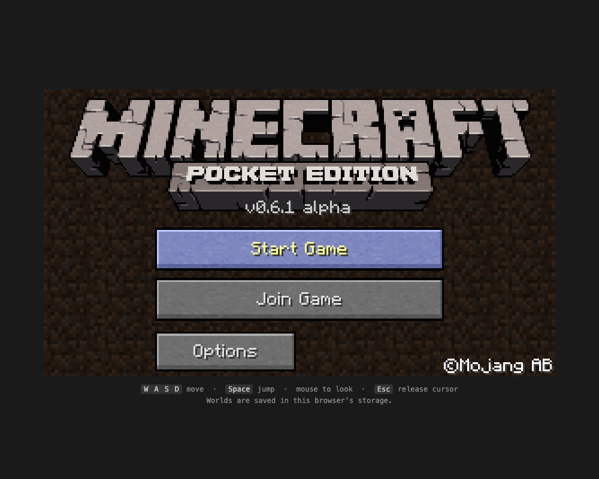
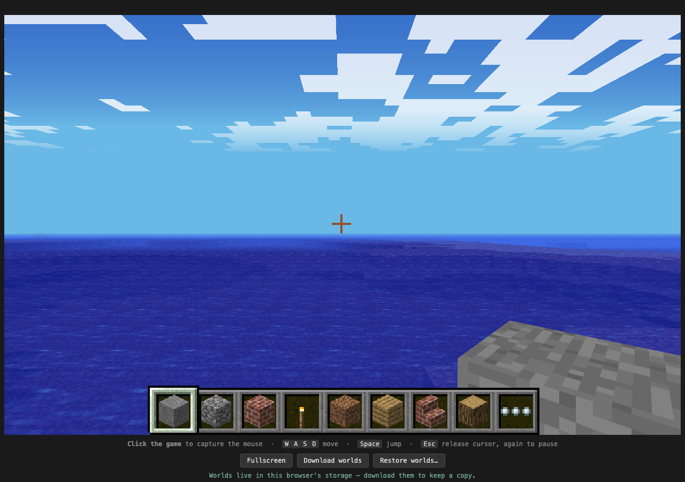

# Minecraft Pocket Edition 0.6.1, in your browser

The 2013 MCPE 0.6.1 source, ported to WebAssembly. The same game that shipped on
the iPod touch and iPad 2, running at 60fps in a browser tab on hardware that
did not exist when it was written.

### ▶ Play it: **https://luispl77.github.io/mcpe-0.6.1-web/**

No install, no plugins. Singleplayer, survival or creative. Worlds save in your
browser and can be downloaded as a `.zip`.




---

## Why

0.6.1 is my favourite version of my favourite game, and I wanted to actually
play it again rather than read about it. The original build targets are long
dead — Eclipse ADT, `ndk-build`, STLport, a licensing library that no longer
exists — so the game needed a new one.

The encouraging discovery is that the game itself is fine. The simulation,
worldgen, rendering and entity code all compile clean under a 2026 Clang at
`-std=c++03` with barely a change. Everything that needed fixing was in the
platform seams around it.

## What works

| | |
|---|---|
| Worldgen, save, reload | ✅ |
| 60 fps | ✅ |
| Keyboard + mouse, pointer lock | ✅ |
| Sound effects | ✅ |
| Fullscreen | ✅ |
| Options that persist | ✅ |
| Music | ❌ |
| Multiplayer | ❌ |

**Multiplayer** cannot work in the browser — RakNet needs raw UDP sockets and
browsers have none. It's disabled rather than half-working.

**Music** was streamed from assets that aren't in the compiled-in PCM sound
bank, so there's nothing to play. Sound effects are all present.

## Controls

| | |
|---|---|
| `W` `A` `S` `D` / arrows | Move |
| `Space` | Jump |
| Mouse | Look — **click the game first** to capture the cursor |
| Left click | Dig |
| Right click | Place |
| `1`–`9` | Select hotbar slot |
| Scroll wheel | Cycle hotbar slot |
| `E` | Inventory |
| `Q` | Crafting (survival only — creative has no crafting in 0.6.1) |
| `G` | Armour |
| `Esc` | Release the cursor; press again for the pause menu |

In the browser the first `Esc` is consumed by the browser itself to exit pointer
lock, which is why it takes two presses to reach the menu.

## Options

Reachable from the title screen **and** from the in-game pause menu. Mouse
sensitivity, invert-Y, render distance, fancy graphics, smooth lighting, view
bobbing, third-person and sound volume — and they now survive a reload, which
they never did in the original source (see below).

**Render distance is the dial to reach for if it runs slowly.** This is a
fixed-function renderer running on WebGL emulation, so view range is most of the
frame budget.

## Your worlds

Browser worlds live in IndexedDB, which the browser may evict on its own and
which "clear browsing data" erases. **Use the `Download worlds` button** — it
produces a `.zip` that `Restore worlds…` reads back, so you can keep a backup or
move a world to another machine. This has been tested by deleting an entire
browser profile and recovering from the zip.

## Building

Needs [emsdk](https://emscripten.org/docs/getting_started/downloads.html):

```sh
source ~/emsdk/emsdk_env.sh
cd handheld/project/web
emcmake cmake -S . -B build
cmake --build build -j8
cd build && python3 -m http.server 8000   # must be served over http, not file://
```

Deploying is a manual GitHub Actions run: `gh workflow run pages.yml --ref main`.

## The interesting bugs

Nearly every problem came from one root cause: **in this codebase `__APPLE__`
means iOS**, and anything not Android/iOS/Win32 falls into mobile-only paths.
That single confusion produced most of the port work — GL headers, PVRTC
textures, Xperia Play input handling, Android D-pad keycodes overriding WASD,
the excluded PCM sound bank, and the sound backend selection.

The same shape shows up in the input code, where whole features were gated to
`WIN32 || RPI` and so simply didn't exist anywhere else: number keys selecting
hotbar slots, Escape closing the inventory, Escape opening the pause menu at
all. None of these were broken so much as unreachable.

The best one was in `anGenBuffers()`:

```c
void anGenBuffers(GLsizei n, GLuint* buffers) {
    static GLuint k = 1;
    for (int i = 0; i < n; ++i) buffers[i] = ++k;   // invented names
}
```

It never called `glGenBuffers`. Desktop GL and GLES 1.1 allow this — binding an
unused buffer name just creates the object. WebGL names are opaque objects that
must come from `createBuffer`, so every draw call in the game failed with
`bufferData: no buffer`. The entire renderer came up from that one fix.

Options persistence turned out to be three independent breakages stacked on each
other: `Options::save()` assembled every setting into a vector and then returned
without writing it; `OptionsFile::getOptionStrings()` opened the file with `"w"`,
which truncates it and yields a stream that cannot be read, so loading both
returned nothing *and* destroyed the file; and the writer emitted `key:value` on
one line while the reader expected key and value on alternating lines. Nothing
had ever persisted. Sensitivity had a fourth problem on top — the saved value
was the curve-transformed one, which got re-transformed on every load, so it
would have crept upwards each run had it ever been read back.

Pointer lock was similar in spirit: browsers only grant it inside a user
gesture, but the game grabs the mouse from its frame callback, and
`mouseGrabbed` was set anyway — so the game believed it held a cursor the
browser had refused, and never asked again.

WebGL has no fixed-function pipeline at all, so the renderer runs on
Emscripten's `-sLEGACY_GL_EMULATION` with `GL_FFP_ONLY=1`, which applies cleanly
because the game never binds a shader of its own.

## Layout

```
handheld/src/              the game (~1350 files, C++03)
handheld/project/web/      Emscripten target + HTML shell
handheld/src/main_sdl.h    SDL2 entry point
handheld/src/AppPlatform_sdl.*  platform layer
```

## Source

This is the leaked 2013 MCPE 0.6.1 handheld source, taken from the Internet
Archive upload at
**https://archive.org/details/Minecraftpesorucecode**.

`main` began as a pristine import of that tree (commit `58e1dea`); every commit
after it is porting work, so `git log` is an exact record of what was changed
and why.

## Legal

Minecraft is a trademark of Mojang AB / Microsoft. This code is theirs, not
mine, and it's published here for preservation and study of a version that has
been unavailable for over a decade. Nothing here is for sale. If a rights holder
objects, the repository comes down.
